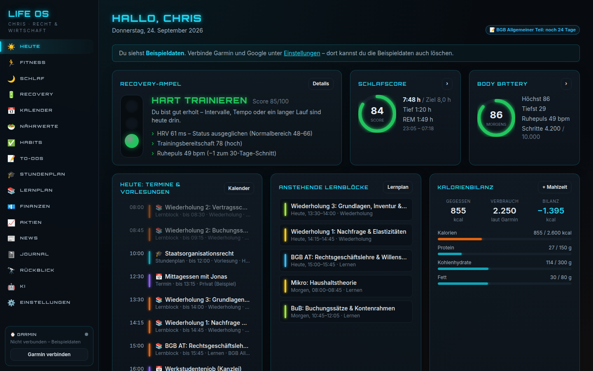
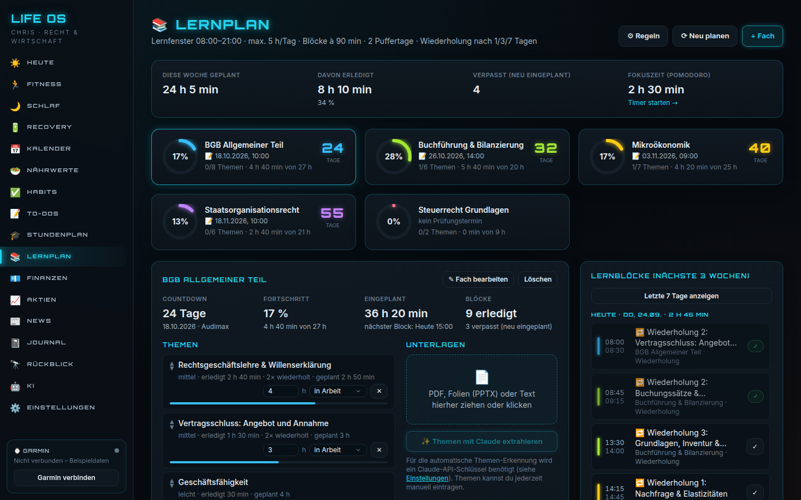
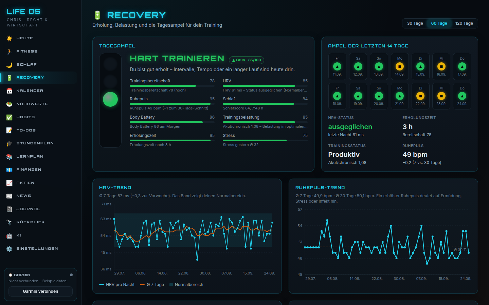

# LIFE OS – dein persönliches Dashboard

Life OS bündelt **Training, Schlaf, Erholung, Studium, Planung, Ernährung, Finanzen und mehr** in einer App, die lokal auf deinem MacBook läuft. Deine Daten bleiben auf deinem Rechner (SQLite-Datenbank im Projektordner).



---

## Inhalt

1. [Was die App kann](#was-die-app-kann)
2. [Schnellstart](#schnellstart)
3. [Schritt für Schritt: Installation auf dem Mac](#schritt-für-schritt-installation-auf-dem-mac)
4. [Die Datei .env](#die-datei-env)
5. [Garmin verbinden](#garmin-verbinden)
6. [Google Kalender verbinden](#google-kalender-verbinden)
7. [Claude API einrichten](#claude-api-einrichten)
8. [Erste Schritte in der App](#erste-schritte-in-der-app)
9. [Datenschutz & Backup](#datenschutz--backup)
10. [Häufige Probleme](#häufige-probleme)
11. [Für Entwickler](#für-entwickler)

---

## Was die App kann

| Reiter | Inhalt |
|---|---|
| ☀️ **Heute** | Recovery-Ampel, Schlafscore, Body Battery, heutige Termine und Vorlesungen, anstehende Lernblöcke, offene To-dos, Habits, Kalorienbilanz |
| 🏃 **Fitness** | Aktivitätenliste mit HF-Zonen, Wochen-/Monatsumfang, Zeit in HF-Zonen, Zone-2-Pace bei gleicher Herzfrequenz, VO2max-Verlauf, Wochenziele, geplante Trainings |
| 🌙 **Schlaf** | Dauer und Phasen pro Nacht, letzte Nächte (Tief-/REM-Schlaf), Score-Verlauf, Einschlaf-/Aufwachzeiten mit Regelmäßigkeit, Schlafziel, Wochen-/Monatsschnitt |
| 🔋 **Recovery** | HRV-Status und -Trend, Ruhepuls, Body Battery, Stress, akute vs. chronische Last, Erholungszeit und die **Tagesampel** (grün = hart trainieren, gelb = locker, rot = Ruhetag) mit Begründung |
| 📅 **Kalender** | Wochen- und Monatsansicht mit Google-Terminen, Stundenplan, Lernblöcken, Trainings und Prüfungen – farblich unterschieden |
| 🥗 **Nährwerte** | Mahlzeiten mit Kalorien und Makros, Tagesziel, Bilanz gegenüber dem Garmin-Verbrauch, Verlauf |
| ✅ **Habits** | Gewohnheiten abhaken, Streaks, Kalender-Heatmap, **Pomodoro-Fokus-Timer** mit Protokoll (verknüpft mit Lernblöcken) |
| 📝 **To-dos** | Aufgaben mit Priorität, Fälligkeit und Fach bzw. Kategorie |
| 🎓 **Stundenplan** | Vorlesungen und Übungen mit Fach, Zeit, Raum und Dozent – wöchentlich oder 14-tägig im Semester, freie Zeitfenster sichtbar |
| 📚 **Lernplan** | Pro Fach Unterlagen (PDF, Folien) hochladen und Prüfungstermin eintragen, Themen per Claude extrahieren (oder manuell), **automatische Lernblöcke** in freien Zeiten, verteilte Wiederholung, Puffertage, verpasste Blöcke werden neu eingeplant, Fortschritt und Countdown |
| 💶 **Finanzen** | Einnahmen/Ausgaben mit Kategorien, Monatsbudget, Übersichtsdiagramme |
| 📈 **Aktien** | Depot und Watchlist, aktuelle Kurse (yfinance), Gewinn/Verlust, Kursdiagramme |
| 📰 **News** | Nachrichten aus deinen RSS-Feeds (Wirtschaft, Recht, Steuern, Sport …) |
| 📓 **Journal** | Morgen- und Abendeintrag mit Leitfragen und Stimmung (1–5), durchsuchbar |
| 🔭 **Rückblick** | Automatische Wochen- und Monatszusammenfassung aller Bereiche mit Vergleich |
| 🤖 **KI** | Chat mit Claude, der auf deine Daten zugreift („Wie war meine Woche?“, „Soll ich heute hart trainieren?“) |
| ⚙️ **Einstellungen** | Verbindungen (Garmin, Google, Claude), Ziele, Lernplan-Regeln, Habits, News-Feeds, Datenexport |

Beim ersten Start legt die App **Beispieldaten** an, damit du alles ohne Logins ansehen kannst. Sie lassen sich unter *Einstellungen → Daten* löschen; die Beispiel-Fitnessdaten verschwinden automatisch beim ersten echten Garmin-Sync.

<p>
  
  
</p>

---

## Schnellstart

Wenn Python (ab 3.10) und Node.js (ab 22) schon installiert sind:

```bash
cd meine-website
./start.sh
```

Die App öffnet sich unter **http://localhost:8000**. Beenden mit **Ctrl + C** im Terminal.

---

## Schritt für Schritt: Installation auf dem Mac

Du brauchst keine Programmierkenntnisse – nur das Programm **Terminal** (Programme → Dienstprogramme → Terminal, oder `⌘ + Leertaste` und „Terminal“ tippen).

### 1. Python installieren

1. Öffne <https://www.python.org/downloads/> und klicke auf den gelben Button **„Download Python 3.x“** (3.12 oder neuer).
2. Öffne die heruntergeladene `.pkg`-Datei und klicke dich durch die Installation.
3. Prüfen: Tippe im Terminal `python3 --version` und drücke Enter. Es sollte z. B. `Python 3.13.1` erscheinen.

### 2. Node.js installieren

1. Öffne <https://nodejs.org/> und lade die **LTS-Version** (mind. 22) als macOS-Installer herunter.
2. Installer öffnen und durchklicken.
3. Prüfen: `node --version` im Terminal → z. B. `v22.x.x`.

### 3. Projekt herunterladen

**Variante A – ohne Git:** Auf der GitHub-Seite des Repositorys auf **„Code“ → „Download ZIP“** klicken, die ZIP-Datei im Finder doppelklicken (entpacken) und den Ordner z. B. in deinen Benutzerordner legen.

**Variante B – mit Git:**

```bash
git clone https://github.com/Chris310703/meine-website.git
```

(Fragt macOS nach den „Command Line Developer Tools“, auf „Installieren“ klicken.)

### 4. In den Projektordner wechseln

Tippe im Terminal `cd ` (mit Leerzeichen!), ziehe dann den Projektordner aus dem Finder ins Terminal-Fenster und drücke Enter.

### 5. App starten

```bash
./start.sh
```

- Beim **ersten Start** werden alle Pakete installiert – das dauert 2–5 Minuten. Danach geht es in Sekunden.
- Der Browser öffnet sich automatisch mit **http://localhost:8000**.
- Kommt „Permission denied“, einmalig `chmod +x start.sh` eingeben und erneut starten.
- **Beenden:** Im Terminal `Ctrl + C` drücken.

Ab jetzt reicht zum Starten immer: Terminal öffnen → `cd` in den Ordner → `./start.sh`.

### 6. Symbol auf dem Schreibtisch (empfohlen)

Noch bequemer mit einem eigenen Programm-Symbol: Im Projektordner einmalig ausführen

```bash
bash desktop-icon.sh
```

Danach liegt **„Life OS“** mit Icon auf deinem Schreibtisch. Ein Doppelklick startet die App (im Terminal-Fenster) und öffnet sie im Browser – läuft sie schon, öffnet sich nur die Seite. Du kannst das Symbol auch ins Dock ziehen.

- Das Terminal-Fenster offen lassen, solange du die App nutzt; Schließen beendet die App.
- Hast du den Projektordner verschoben, `bash desktop-icon.sh` einfach erneut ausführen.

---

## Die Datei .env

In der Datei `.env` im Projektordner stehen deine Zugangsdaten. Sie wird beim ersten Start automatisch aus `.env.example` erzeugt und **niemals zu GitHub hochgeladen** (sie steht in `.gitignore`).

So öffnest du sie:

```bash
open -e .env
```

(Im Finder ist sie versteckt – mit `⌘ + ⇧ + .` blendest du versteckte Dateien ein.)

Nach jeder Änderung an der `.env` die App neu starten (`Ctrl + C`, dann `./start.sh`).

---

## Garmin verbinden

Die App nutzt die Python-Bibliothek **garminconnect** (inoffizielle Garmin-Connect-Schnittstelle) für deine Forerunner 265 und den HRM-600.

**Variante A (empfohlen) – in der App:**

1. *Einstellungen → Verbindungen → Garmin Connect*.
2. E-Mail und Passwort deines Garmin-Kontos eingeben → **„Mit Garmin verbinden“**.
3. Hast du die Zwei-Faktor-Authentifizierung aktiv, schickt Garmin dir einen Code per E-Mail/SMS – einfach im erscheinenden Feld eingeben.
4. Das Passwort wird **nicht gespeichert**, nur ein Login-Token in `backend/data/garmin_tokens/` (nicht im Git).

**Variante B – über die .env:**

```
GARMIN_EMAIL=deine@mail.de
GARMIN_PASSWORD=dein-passwort
```

**Synchronisieren:**

- Beim App-Start wird automatisch synchronisiert, außerdem über **„Jetzt synchronisieren“** unten links in der Seitenleiste.
- Der erste Sync lädt 6 Wochen (dauert ca. 1–2 Minuten), danach nur die letzten Tage. Mehr Verlauf: *Einstellungen → „90 Tage nachladen“*.
- Daten werden ohne Duplikate gespeichert – mehrfaches Synchronisieren ist unproblematisch.
- Die App funktioniert auch ohne Sync mit den zuletzt gespeicherten Daten.

---

## Google Kalender verbinden

Einmalige Einrichtung in der Google Cloud Console (ca. 10 Minuten):

1. Öffne <https://console.cloud.google.com/> und melde dich mit deinem Google-Konto an.
2. Oben links auf die Projektauswahl → **„Neues Projekt“** → Name z. B. `Life OS` → **Erstellen**.
3. Menü **„APIs & Dienste“ → „Bibliothek“** → nach **„Google Calendar API“** suchen → **Aktivieren**.
4. Menü **„APIs & Dienste“ → „OAuth-Zustimmungsbildschirm“** (heißt teils auch „Google Auth Platform“):
   - Nutzertyp **„Extern“**, App-Name `Life OS`, deine E-Mail als Support- und Entwickler-Kontakt → speichern.
   - Unter **„Zielgruppe“ / „Testnutzer“** deine eigene Gmail-Adresse als **Testnutzer** hinzufügen.
5. Menü **„APIs & Dienste“ → „Anmeldedaten“ → „Anmeldedaten erstellen“ → „OAuth-Client-ID“**:
   - Anwendungstyp: **Webanwendung**
   - Unter **„Autorisierte Weiterleitungs-URIs“** eintragen: `http://localhost:8000/api/google/callback`
   - **Erstellen** → im Dialog **„JSON herunterladen“**.
6. Die heruntergeladene Datei in **`google_client_secret.json`** umbenennen und in den Ordner **`backend/data/`** legen (der Ordner entsteht beim ersten Start).
7. App neu starten → *Einstellungen → Verbindungen → „Mit Google verbinden“*.
8. Google zeigt „Google hat diese App nicht überprüft“ – das ist normal, weil es deine eigene App ist: **„Erweitert“ → „Weiter zu Life OS“** → Zugriff erlauben.
9. Zurück in der App die Kalender anhaken, die gelesen werden sollen.

Die App legt automatisch den Kalender **„Life OS – Lernplan“** an und trägt dort Lernblöcke und geplante Trainings ein. Ändert sich der Lernplan, werden die Termine aktualisiert bzw. gelöscht.

> **Hinweis:** Solange die Google-App im Status „Test“ ist, läuft die Anmeldung nach 7 Tagen ab – dann einfach erneut verbinden. Dauerhaft vermeidest du das, indem du im OAuth-Zustimmungsbildschirm auf **„App veröffentlichen“** klickst (für die private Nutzung ist keine Überprüfung nötig).

---

## Claude API einrichten

Claude wird für die **Themen-Extraktion im Lernplan**, den **KI-Chat** und die **KI-Zusammenfassung im Rückblick** genutzt. Alle anderen Funktionen laufen auch ohne Schlüssel.

1. Auf <https://console.anthropic.com/> registrieren bzw. anmelden.
2. Unter **„Billing“** Guthaben aufladen (5–10 € reichen für viele Anfragen).
3. Unter **„API Keys“ → „Create Key“** einen Schlüssel erstellen und kopieren (beginnt mit `sk-ant-`).
4. In der `.env` eintragen:

   ```
   ANTHROPIC_API_KEY=sk-ant-...
   ```

5. App neu starten und unter *Einstellungen → Verbindungen → „Verbindung testen“* prüfen.

**Modell:** Standard ist `claude-opus-5`. Günstiger (und schneller) geht es mit `CLAUDE_MODEL=claude-sonnet-5` in der `.env`.
Für Opus 5 ist der **serverseitige Fallback** aktiviert: Lehnt das Modell eine Anfrage aus Sicherheitsgründen ab, beantwortet Anthropic sie automatisch mit einem geeigneten Ersatzmodell.

---

## Erste Schritte in der App

1. **Stundenplan:** Semesterzeitraum festlegen (🗓️ Semester) und Vorlesungen/Übungen eintragen. Doppelklick ins Raster legt einen Termin an.
2. **Lernplan:** Für jedes Fach **„+ Fach“** mit Prüfungstermin anlegen, Unterlagen hochladen und **„Themen mit Claude extrahieren“** – oder Themen manuell eintragen (`Titel | Stunden | Schwierigkeit`). Die Lernblöcke werden automatisch in freie Zeiten gelegt.
3. **Lernplan-Regeln** anpassen: *Einstellungen → Lernplan* (Lernfenster, max. Stunden pro Tag, Blocklänge, Puffertage, Wiederholungsabstände, Lerntage).
4. **Ziele** setzen: *Einstellungen → Ziele* (Schlaf, Kalorien, Training, Budget, HF-Zonen wie in Garmin Connect).
5. **Trainings planen:** *Fitness → Geplante Trainings* – sie blockieren Lernzeit und erscheinen im Google-Kalender.
6. **Aktien:** Symbole wie bei Yahoo Finance verwenden, z. B. `SAP.DE` (Xetra), `EUNL.DE` (ETF), `AAPL` (USA). Kurse sind ca. 15 Minuten verzögert.
7. **News:** Eigene RSS-Feeds unter *Einstellungen → News-Feeds* hinzufügen.

---

## Datenschutz & Backup

- Alle Daten liegen lokal in **`backend/data/`**: Datenbank (`lifeos.db`), hochgeladene Unterlagen, Garmin- und Google-Token.
- Dieser Ordner und die `.env` stehen in `.gitignore` und werden nie hochgeladen.
- **Backup:** den Ordner `backend/data/` kopieren. Export als JSON oder CSV: *Einstellungen → Daten*.
- Nach außen geht nur, was für die Anbindungen nötig ist: Garmin (Abruf deiner Daten), Google Kalender, Yahoo Finance (Kurse), RSS-Feeds und – nur wenn du KI-Funktionen nutzt – die für die Antwort nötigen Daten an die Claude API.

---

## Häufige Probleme

| Problem | Lösung |
|---|---|
| `python3: command not found` oder „Python 3.10 oder neuer wurde nicht gefunden“ | Python von python.org installieren (Schritt 1), Terminal neu öffnen. |
| „Node.js … ist zu alt“ | Aktuelle LTS-Version von nodejs.org installieren. |
| „Address already in use“ / Port belegt | Läuft die App schon in einem anderen Terminal? Sonst in der `.env` `LIFEOS_PORT=8010` setzen (bei Google dann auch die Weiterleitungs-URI anpassen). |
| Garmin: „zu viele Anmeldeversuche“ | Garmin sperrt kurzzeitig – 10–15 Minuten warten. |
| Garmin: Zwei-Faktor-Code wird verlangt | Code in der App eingeben (erscheint automatisch). |
| Google: `redirect_uri_mismatch` | Weiterleitungs-URI exakt so eintragen: `http://localhost:8000/api/google/callback` |
| Google: `access_denied` / „Zugriff blockiert“ | Deine Gmail-Adresse als **Testnutzer** eintragen (Schritt 4). |
| Claude: „Schlüssel ungültig“ / „Guthaben aufgebraucht“ | Schlüssel in der `.env` prüfen bzw. Guthaben aufladen, App neu starten. |
| Aktienkurse fehlen | Symbol prüfen (z. B. `SAP.DE`). Ohne Internet werden die zuletzt gespeicherten Kurse angezeigt. |
| Ein News-Feed zeigt „Fehler“ | Adresse unter *Einstellungen → News-Feeds* prüfen oder ersetzen. |
| Alles zurücksetzen | App beenden und `backend/data/lifeos.db` löschen (**löscht alle Daten!**). Beim nächsten Start werden wieder Beispieldaten angelegt. |

---

## Für Entwickler

```bash
./start.sh dev    # Backend mit Auto-Reload (Port 8000) + Vite-Dev-Server (http://localhost:5173)
./start.sh test   # Backend-Tests (pytest)
```

- **Backend:** Python, FastAPI, SQLAlchemy, SQLite – `backend/app/`
  - `services/study_planner.py` – Lernplan-Algorithmus (reine Funktion, getestet)
  - `services/recovery.py` – Recovery-Ampel (reine Funktion, getestet)
  - `services/garmin_sync.py`, `services/google_calendar.py`, `services/claude_ai.py` – Anbindungen
  - `seed.py` – Beispieldaten
- **Frontend:** React, Vite, Tailwind CSS, Recharts – `frontend/src/`
- **API-Dokumentation:** bei laufender App unter <http://localhost:8000/docs>
- Weitere Einstellungen in `.env.example` (`LIFEOS_DEMO_DATA`, `LIFEOS_AUTO_SYNC`, `LIFEOS_TIMEZONE`, `CLAUDE_EFFORT`).
